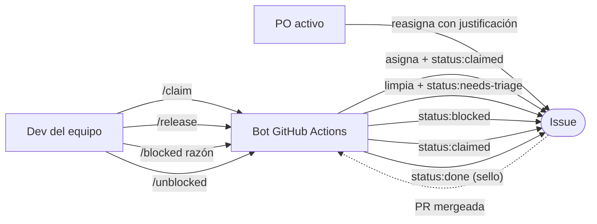
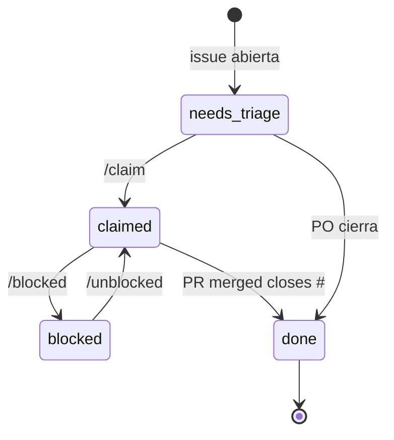
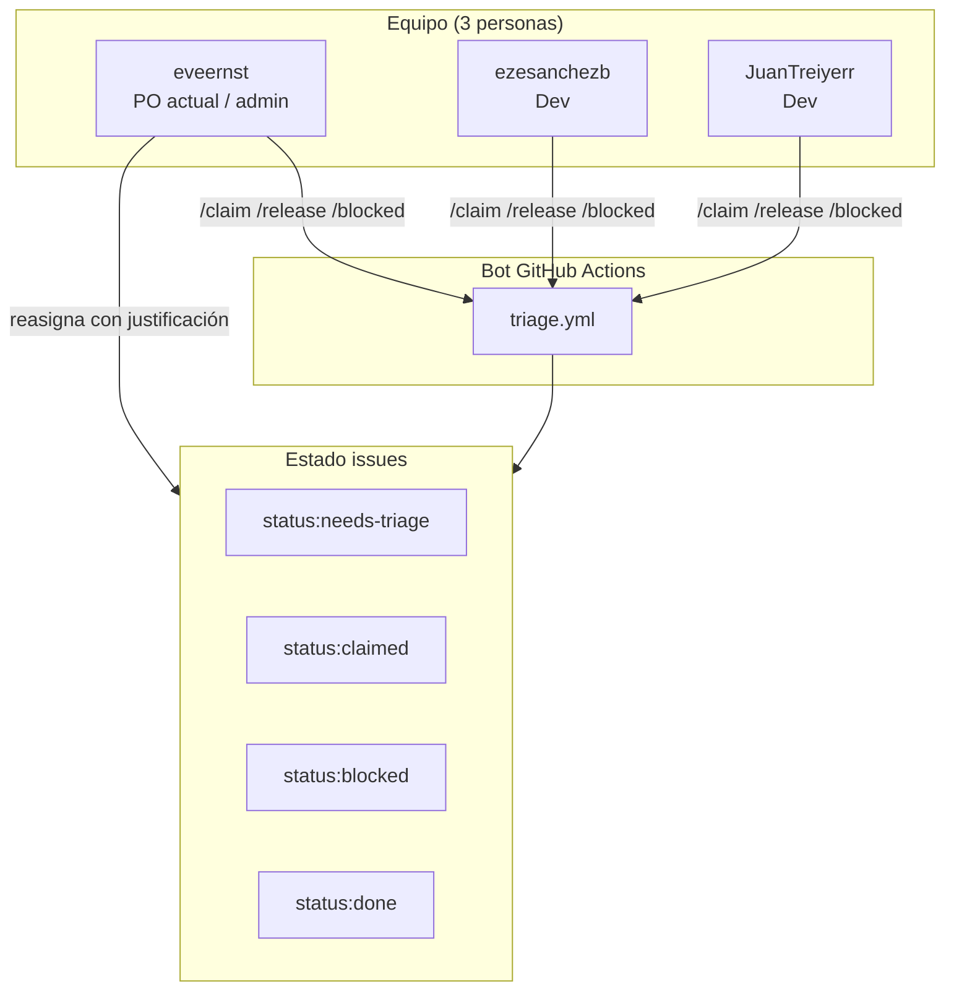

# 🚀 QUICKSTART — inmobiliaria_api triage workflow

> Esta guía es para **dos audiencias**:
> 1. **Devs nuevos en el equipo** que necesitan entender cómo trabajar con issues.
> 2. **Evaluadores de la materia** que necesitan auditar quién hizo qué.
>
> Leé primero §1 (overview), después salta a tu audiencia.

---

## Índice

1. [El modelo en 1 pantalla](#1-el-modelo-en-1-pantalla)
2. [Para devs: 3 escenarios paso-a-paso](#2-para-devs-3-escenarios-paso-a-paso)
   - 2.1 [Tomar y terminar una issue](#21-tomar-y-terminar-una-issue)
   - 2.2 [Una semana como PO](#22-una-semana-como-po)
   - 2.3 [Issue bloqueada](#23-issue-bloqueada)
3. [Para evaluadores: auditoría rápida](#3-para-evaluadores-auditoria-rapida)
4. [Anti-patrones: lo que NO hacemos](#4-anti-patrones-lo-que-no-hacemos)
5. [Ver también](#5-ver-tambien)

---

## 1. El modelo en 1 pantalla



| Comando | Quién | Efecto |
|---|---|---|
| `/claim` | Cualquier colaborador del repo | Toma la issue (lock activo) |
| `/release` | Solo el assignee actual | Libera la issue (vuelve al pool) |
| `/blocked <razón>` | Solo el assignee actual | Marca como bloqueada con razón |
| `/unblocked` | Solo el assignee actual | Desbloquea |
| (PR a `.github/ROTA.yml`) | Cuando el equipo decide | Cambia el PO activo |

**Equipo** (repo personal, no de organización — por eso el bot acepta `COLLABORATOR`
además de `MEMBER`/`OWNER` en el chequeo de `/claim`):

| Handle | Rol |
|---|---|
| @eveernst | Admin del repo, PO actual (ver `.github/ROTA.yml`) |
| @ezesanchezb | Dev |
| @JuanTreiyerr | Dev |

---

## 2. Para devs: 3 escenarios paso-a-paso

### 2.1 Tomar y terminar una issue

**Contexto**: @ezesanchezb ve una issue nueva en el tablero. La lee, le interesa, y decide tomarla.

#### Pasos narrativos

1. **@ezesanchezb abre el tablero de issues** y busca una con label `status:needs-triage` y
   `area:insurance-record` (su área). Encuentra **#12 "Agregar @IsOptional() faltante en el resto
   de los DTOs de creación"** que coincide.

2. **Lee la issue** (acepta los criterios). Se siente cómodo para resolverla en un par de horas.

3. **Comenta `/claim`** en la issue.

4. **El bot responde** con un comentario: *"✅ Issue tomada por @ezesanchezb. Lock activo — nadie
   más puede desasignarte."*. La issue ahora tiene label `status:claimed` y es el único assignee.

5. **Abre una rama**: `git switch -c fix/12-dto-isoptional`.

6. **Desarrolla**, corriendo `npm run precommit` antes de cada commit importante. Cuando termina,
   hace commit y push.

7. **Abre la PR** usando la plantilla `PULL_REQUEST_TEMPLATE.md`. Completa el checklist:
   - [x] `npm run precommit` corre limpio
   - [x] Campos opcionales de DTO con `@IsOptional()`
   - El body dice: `Closes #12`

8. **Marca la PR como Ready for Review** (saca el draft).

9. **@eveernst (PO actual) aprueba la PR** — recordá que `master` tiene branch protection:
   hace falta 1 approval y el check `build-and-test` en verde para poder mergear.

10. **El bot** cambia la label de `status:claimed` a `status:done` y comenta en #12:
    *"✅ Issue cerrada vía PR #15. status:claimed → status:done (sello histórico, no se quita)."*

#### Comandos `gh` correspondientes

```bash
# Paso 3: /claim
gh issue comment 12 --body "/claim"

# Paso 5: crear rama
git switch -c fix/12-dto-isoptional

# Paso 7: abrir PR (cuando esté lista)
gh pr create --draft \
  --title "fix: add missing @IsOptional() on remaining DTOs" \
  --body "$(cat <<'EOF'
## Qué cambia
Agrega @IsOptional() a los campos opcionales que faltaban en create-rented,
create-writing, create-installation, create-plan y create-property.

## Issue
Closes #12

## Checklist
- [x] npm run precommit corre limpio
- [x] Campos opcionales de DTO con @IsOptional()

## Notas para el reviewer
Mismo patrón que el fix ya mergeado en create-insurance.dto.ts.
EOF
)"

# Paso 8: marcar como ready
gh pr ready 15

# Verificación post-merge
gh issue view 12 --json labels,assignees,state
# Esperado: state="closed", labels incluye "status:done"
```

---

### 2.2 Una semana como PO

**Contexto**: @eveernst es el PO activo. Le toca revisar las decisiones de producto y destrabar.

#### Escenario A: Responder a issue con `triage:rotating`

1. **@JuanTreiyerr abre la issue #20** "Decidir si `Property.state` pasa a ser un enum en vez de
   `number`". Le pone label `triage:rotating` porque necesita decisión de producto.

2. **@eveernst lee la issue #20**, evalúa el impacto en las entidades relacionadas, y decide:
   "Sí, pero en una migración aparte para no romper los `number` ya guardados".

3. **@eveernst comenta en #20** la decisión con justificación. Reasigna la issue a @JuanTreiyerr
   para que implemente.

4. **Como @eveernst es PO**, el hard lock lo deja reasignar sin problema.

```bash
# Paso 2: el PO lee el contexto
gh issue view 20 --json body,comments

# Paso 3: el PO reasigna (PO bypass)
gh issue edit 20 --add-assignee JuanTreiyerr --remove-assignee eveernst
# El bot va a comentar "🔧 PO de la semana (@eveernst) reasignó esta issue."
```

#### Escenario B: Decisión de prioridad

1. **@ezesanchezb abre #25** "Exportar CSV de propiedades". Le pone `priority:p2` (backlog).

2. **El PO (@eveernst) decide** que esto hace falta para la entrega y lo sube a `priority:p1`.

```bash
gh issue edit 25 --remove-label "priority:p2" --add-label "priority:p1"
```

---

### 2.3 Issue bloqueada

**Contexto**: @JuanTreiyerr tomó #30 "Migrar SSL config para producción" hace unos días. Se topó
con que la decisión sobre qué proveedor de hosting se usa en producción todavía no está tomada.

#### Diagrama de estados



#### Pasos narrativos

1. **@JuanTreiyerr comenta** `/blocked esperando definición de proveedor de hosting para prod` en #30.

2. **El bot agrega** label `status:blocked` y comenta confirmando la razón.

3. **@JuanTreiyerr avisa por chat** al equipo. @eveernst (PO) toma la decisión y la comenta en #30.

4. **@JuanTreiyerr lee la decisión, está de acuerdo**, y comenta `/unblocked` en #30.

5. **El bot remueve** `status:blocked`, agrega `status:claimed`.

6. **@JuanTreiyerr sigue con el trabajo** y eventualmente abre la PR que cierra #30.

#### Comandos `gh` correspondientes

```bash
# Paso 1: bloquear
gh issue comment 30 --body "/blocked esperando definición de proveedor de hosting para prod"

# Verificar estado
gh issue view 30 --json labels
# Esperado: labels incluye ["status:blocked"]

# Paso 4: desbloquear
gh issue comment 30 --body "/unblocked"

# Verificar
gh issue view 30 --json labels
# Esperado: labels incluye ["status:claimed"], NO incluye "status:blocked"
```

---

## 3. Para evaluadores: auditoría rápida

Esta sección te dice cómo responder las preguntas típicas de la defensa de la materia usando `gh`.

### Preguntas frecuentes

| # | Pregunta | Comando | Output esperado |
|---|---|---|---|
| 1 | ¿Quién es el PO actual? | `gh api repos/eveernst/inmobiliaria_api/contents/.github/ROTA.yml --jq '.content' \| base64 -d` | `current_po: "@..."` |
| 2 | ¿Qué issues están tomadas ahora? | `gh issue list --label status:claimed --json number,title,assignees` | Lista de issues con assignee |
| 3 | ¿Qué issues están bloqueadas? | `gh issue list --label status:blocked` | Lista de issues bloqueadas |
| 4 | ¿Quién trabajó más issues? | `gh issue list --state closed --json assignees --limit 200 \| jq '[.[] \| .assignees[0].login] \| group_by(.) \| map({user: .[0], count: length}) \| sort_by(.count) \| reverse'` | Tabla con count por dev |
| 5 | ¿Qué PRs mergeadas cerraron issues? | `gh pr list --state merged --search "Closes" --json number,title,closingIssuesReferences` | Lista con issues cerradas |
| 6 | ¿Hay issues sin asignar hace mucho? | `gh issue list --label status:needs-triage --json number,title,createdAt --limit 20` | Lista ordenada por fecha |
| 7 | ¿El branch protection de `master` está activo? | `gh api repos/eveernst/inmobiliaria_api/branches/master/protection --jq '{checks: .required_status_checks.contexts, approvals: .required_pull_request_reviews.required_approving_review_count}'` | CI obligatorio + 1 approval |

### Diagrama de actores + responsabilidad



---

## 4. Anti-patrones: lo que NO hacemos

1. **No `/claim` una issue que no podés empezar ahora.** Bloqueás el camino de otro. Si tenés que
   tomarla pero no podés empezar ya, dejá que otro la tome; cuando se libere, `/claim` vos.

2. **No reasignes manualmente una issue asignada a otro.** Si la querés, pedile al assignee que
   haga `/release`. El hard lock existe para proteger el contexto del que arrancó.

3. **Editá `.github/ROTA.yml` con un PR cuando cambie el PO activo.** Es la única manera de cambiar
   quién es el PO; los pushes directos a `master` están bloqueados por branch protection.

4. **No uses el PO como excusa para no tomar issues.** El PO coordina y destraba, pero también
   puede `claim` y trabajar como cualquier dev.

5. **No mergees sin que el check `build-and-test` esté verde y sin 1 approval.** `master` tiene
   branch protection — no hay forma de saltearlo, ni para admins.

---

## 5. Ver también

- **[`.github/CONTRIBUTING.md`](./CONTRIBUTING.md)** — reglas formales, vocabulario completo de labels.
- **[`.github/PULL_REQUEST_TEMPLATE.md`](./PULL_REQUEST_TEMPLATE.md)** — checklist que vas a usar cuando abras una PR.
- **[`.github/ROTA.yml`](./ROTA.yml)** — quién es el PO activo (editable con un PR).
- **[`CLAUDE.md`](../CLAUDE.md)** — arquitectura, comandos y reglas de seguridad del proyecto.

---

> **TL;DR**: Si entendés el modelo, todo lo demás es obvio. Si no, releé §1 hasta que el diagrama
> Mermaid te cierre. Después seguí con tu escenario.
